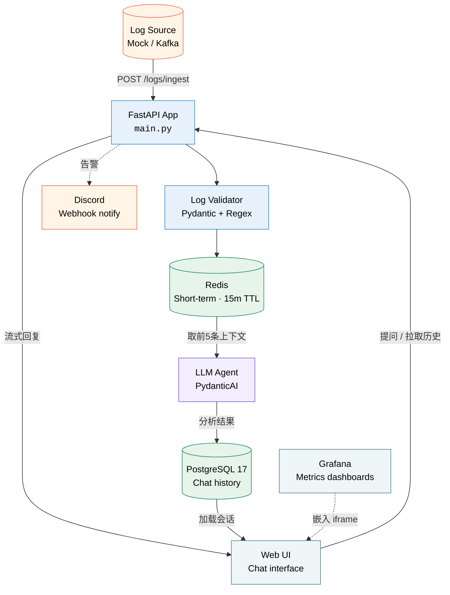
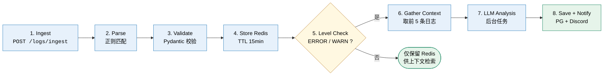
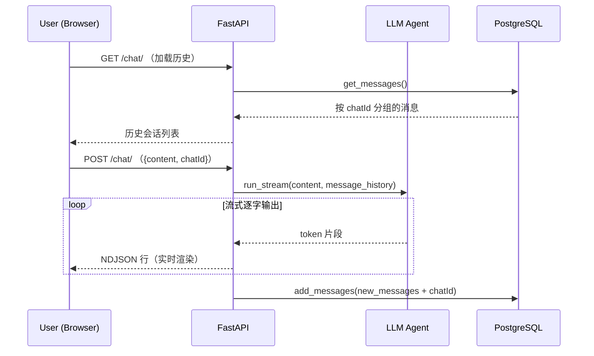
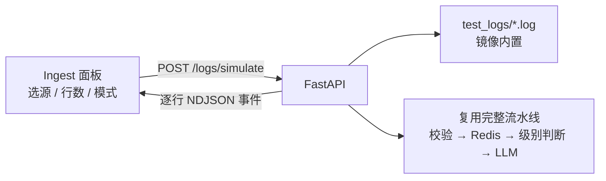
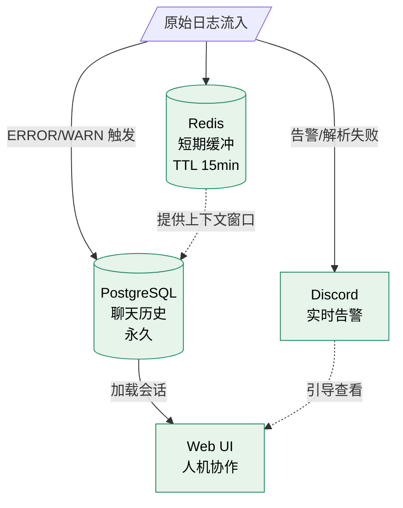

# AI Agent for Application Log Analysis — 业务逻辑文档

> 实时分析应用日志、检测异常、通知用户、建议修复方案，并辅助解决 DevOps 问题。
> 系统从日志流中自动识别 `ERROR`/`WARN` 级别事件，交由 LLM 智能体生成诊断与修复建议。

---

## 1. 业务概览

系统围绕两条核心业务线展开：

1. **自动化日志分析流水线**（主业务）— 从应用日志中捕获 `ERROR`/`WARN` 事件，调用 LLM 生成分析报告并持久化。
2. **交互式对话**（辅助业务）— 运维人员通过 Web 界面与智能体对话，查询历史诊断、追问修复细节。

> **设计要点**：日志分析以 FastAPI 后台任务（`BackgroundTasks`）异步执行，不阻塞日志摄入响应；LLM 调用、数据库读写、Redis 操作均为异步，整体链路无阻塞等待。

---

## 2. 系统架构

### 2.1 组件关系图



**图例**：

| 颜色 | 含义 | 示例 |
|---|---|---|
| 橙色 | External（外部参与者） | 日志源、Discord |
| 蓝色 | Service（内部服务） | FastAPI、校验器 |
| 绿色 | Database（存储） | PostgreSQL、Redis |
| 紫色 | LLM（模型） | PydanticAI Agent |
| 青色 | UI（用户界面） | Web UI、Grafana |

---

## 3. 核心业务流：日志分析流水线

这是系统的主要业务逻辑。应用日志（模拟 Kafka 流）通过 `/logs/ingest` 端点进入系统，经过解析、校验、存储、级别判断后，触发 LLM 智能体分析，结果写入聊天历史库并通知 Discord。

### 3.1 处理流程图



### 3.2 关键步骤详解

| 步骤 | 说明 |
|---|---|
| **1–3 摄入与校验** | 原始日志字符串经正则 `r"^\[(.*?)\] (\w+)..."` 匹配出时间戳、级别、组件、消息、来源五个字段，再用 Pydantic `MockKafkaLogEntry` 模型校验。不匹配或校验失败则标记为 `invalid_log`，走异常通知分支。 |
| **4 Redis 短期存储** | 每条日志生成微秒级 ID（`微秒时间戳:6位UUID`），写入 Redis 并加入有序集合 `temp_logs`，按时间排序，TTL 15 分钟。这为"取前 5 条日志作为上下文"提供时间窗口查询能力。 |
| **5 级别判断（决策点）** | 仅当日志级别为 `ERROR` 或 `WARN` 时才进入分析链路；`INFO` 等级别仅存 Redis 供上下文检索，不触发智能体，避免无效 LLM 调用。 |
| **6–7 上下文与 LLM 分析** | 通过 `get_logs_before` 从 Redis 取出当前日志之前的 5 条记录，连同触发日志组成 bundle 传给 `LogAgent`。智能体的系统提示定位为"DevOps 专家"，分析错误、警告与异常模式，给出可执行的修复建议。 |
| **8 落库与通知** | LLM 分析结果（含 chatId）写入 PostgreSQL `messages` 表，同时向 Discord 推送告警，引导用户到 Web UI 查看。 |

> **异步执行**：LLM 分析作为 FastAPI `BackgroundTasks` 在后台运行，`/logs/ingest` 端点立即返回 `{"status": "received"}`，日志高频涌入时不阻塞。

---

## 4. 日志格式与样例

### 4.1 标准格式

```
[timestamp] LEVEL [component] message (source)
```

- 方括号内为时间戳，格式 `%Y-%m-%d %H:%M:%S,%f`
- `LEVEL` 为日志级别（`INFO` / `WARN` / `ERROR` 等）
- `[component]` 与 `(source)` 字段可选

### 4.2 真实样例（Kafka 服务端日志）

```
[2025-04-25 22:35:17,516] INFO Registered kafka:type=kafka.Log4jController MBean (kafka.utils.Log4jControllerRegistration$)
```

> 测试数据源自 `test_logs/deanonymized_server.log`，约 10 万行真实 Kafka 服务端日志。

### 4.3 校验后 JSON 结构

```json
{
  "timestamp": "2025-04-25T22:35:17.516000",
  "level": "INFO",
  "component": "kafka.utils.Log4jControllerRegistration$",
  "message": "Registered kafka:type=kafka.Log4jController MBean",
  "source": null
}
```

---

## 5. 辅助业务流：交互式对话

Web UI（`Mock_UI/chat_app.html`）提供类 ChatGPT 的多会话界面。用户提问经 `POST /chat/` 流式返回 LLM 回答，历史会话按 `chatId` 分组持久化到 PostgreSQL。



| 能力 | 说明 |
|---|---|
| **会话管理** | 每个 `chatId` 对应一段独立对话，消息按时间排序，UI 侧按日期分组展示历史，支持新建、切换、删除。 |
| **流式响应** | 后端用 `agent.run_stream` 逐字输出，前端通过 `ReadableStream` 实时渲染，低延迟反馈。 |
| **模型切换** | `POST /set_model/` 在运行时切换底层 LLM，无需重启。 |
| **导出** | 前端支持将会话导出为 PDF / TXT。 |

---

## 5.1 内置日志摄入模拟器（Log Ingest Simulator）

为方便测试，原 `Mock_Services/sent_logs.ipynb` 的回放能力已集成进前后端，无需单独运行 notebook。



- **触发**：顶栏 **Ingest** 按钮打开模拟器面板。
- **后端**：`/logs/sources` 列出镜像内置测试文件；`/logs/simulate` 流式回放，逐行走完整套流水线。
- **回放模式**：Instant（立即）、Fixed delay（固定间隔）、Realtime（按日志原始时间戳间隔）。
- **实时反馈**：进度条、统计卡片（已发送 / 触发 AI / 无效 / 错误）、日志流（高亮 ERROR/WARN）。
- **`test_logs/` 目录**已通过 Dockerfile 打包进镜像，容器内即用。

---

## 6. API 端点

| 方法 | 路径 | 类型 | 说明 |
|---|---|---|---|
| `POST` | `/logs/ingest` | External | 提交单条日志触发异步 LLM 分析（**核心入口**） |
| `GET` | `/logs/sources` | Internal | 列出镜像内置的测试日志文件（供 Ingest 模拟器选择） |
| `POST` | `/logs/simulate` | Internal | 流式回放某个测试日志文件，逐行经过完整流水线（供 Ingest 模拟器使用） |
| `GET` | `/` | Internal | 重定向到聊天 UI 页面 |
| `GET` | `/chat/` | Internal | 获取全部聊天历史（前端主端点） |
| `POST` | `/chat/` | Internal | 发送消息，流式返回 LLM 回复 |
| `DELETE` | `/chat/delete` | Internal | 按 `chatId` 删除会话及其消息 |
| `POST` | `/set_model/` | Internal | 运行时切换 LLM 模型 |

> **External** 面向最终用户/外部系统；**Internal** 为前端调用的系统端点。

---

## 7. 支持的 LLM 提供商

| 提供商 | 模型 | 接入方式 | 默认 |
|---|---|---|:---:|
| OpenAI | `gpt-3.5-turbo` / `gpt-4` | 官方 API | |
| Anthropic | `claude-3-5-sonnet` | 官方 API | |
| DeepSeek | `deepseek-chat` | 官方 API | |
| Ollama（本地） | `gemma2:2b` | OpenAI 兼容端点 | |
| 智谱 AI (GLM) | `glm-4-flash` | OpenAI 兼容端点 | ✅ |

> 通过环境变量 `DEFAULT_MODEL` 配置，当前默认为 `zhipu`（智谱 GLM-4-Flash，OpenAI 兼容接口，国内可直连）。所有模型统一由 `LogAgent` 类管理，支持运行时热切换。

---

## 8. 技术栈

| 层级 | 技术 | 用途 |
|---|---|---|
| Web 框架 | **FastAPI** | 异步 Web 框架，承载所有端点 |
| AI 框架 | **PydanticAI** | 封装 LLM 调用与消息历史 |
| 数据库驱动 | **asyncpg** | 异步 PostgreSQL 驱动 |
| 数据校验 | **Pydantic** | 数据校验与解析 |
| 可观测性 | **Logfire** | 链路追踪与遥测 |
| 主数据库 | **PostgreSQL 17** + TimescaleDB | 聊天历史持久化 |
| 缓存 | **Redis** | 短期日志缓存（TTL 15min） |
| 监控 | **Grafana / Prometheus** | 可选监控栈 |
| 编排 | **Docker Compose** | 一键编排全栈 |
| 通知 | **Discord Webhook** | 告警通知通道 |

---

## 9. 数据生命周期



| 存储 | 角色 | 数据特征 |
|---|---|---|
| **Redis** | 短期日志缓冲 | 每条日志以微秒 ID 为 key 存储，同步加入有序集合按时间排序；15 分钟后自动过期，仅用于提供分析上下文窗口。 |
| **PostgreSQL** | 持久化聊天历史 | `messages` 表存储 JSONB 消息列表 + `chatId` + 时间戳，既保存 LLM 自动分析结果，也保存用户对话，按 `chatId` 检索。 |
| **Discord** | 实时告警出口 | `ERROR`/`WARN` 日志触发分析时，以及遇到无法解析的日志时，均向 Discord 频道推送告警，引导用户到 Web UI 查看。 |

---

## 10. 项目目录结构

```
AI_Agent-Log_Analyzer/
├── app/                          # 后端（按服务拆分）
│   ├── main.py                   # 应用入口：装配 + 路由挂载
│   ├── config.py                 # 集中的环境变量配置
│   ├── deps.py                   # 共享依赖（DB / Redis / Agent 注入）
│   ├── chat/                     # 聊天服务（对话 + 模型切换）
│   │   ├── routes.py             #   /chat/、/chat/delete、/set_model/
│   │   ├── service.py            #   消息转换 + 流式响应
│   │   ├── repository.py         #   异步 PostgreSQL 持久化（ChatDB）
│   │   ├── schemas.py            #   ChatMessage、ChatDeleteRequest
│   │   └── initdb17/init_db.sql  #   数据库初始化脚本
│   ├── logs/                     # 日志分析服务（摄入 + 模拟器）
│   │   ├── routes.py             #   /logs/ingest、/logs/sources、/logs/simulate
│   │   ├── service.py            #   process_single_log + LLM 分析
│   │   ├── repository.py         #   异步 Redis 短期存储
│   │   ├── simulator.py          #   样例日志回放引擎
│   │   ├── parsing.py            #   日志解析、格式化、Discord 通知
│   │   └── schemas.py            #   MockKafkaLogEntry
│   └── llm/                      # 共享 LLM 能力
│       └── agent.py              #   LogAgent（模型配置 + 热切换）
├── Mock_UI/
│   ├── chat_app.html             # Web UI 页面
│   ├── chat_app.ts               # 前端逻辑（TypeScript）
│   └── styles.css                # 样式
├── Mock_Services/
│   └── sent_logs.ipynb           # 模拟日志发送脚本（legacy，已集成进 UI）
├── test_logs/
│   └── deanonymized_server.log   # 测试用真实 Kafka 日志
├── grafana/                      # Prometheus/Grafana 配置（可选）
├── docker-compose.yml            # 统一编排：app + postgres + redis + monitoring
├── Dockerfile
├── sample.env                    # 环境变量模板
└── BUSINESS_LOGIC.md             # 本文档
```

---

## 11. 一句话总结

> 一个面向 DevOps 场景的 **"日志 → LLM 智能体 → 诊断建议 → 人机协作"** 闭环系统：
> 自动从日志流中捕获告警级别事件，用大模型生成可执行的修复建议，沉淀为可追溯、可对话的知识库，并通过 Discord 实时触达运维人员。
