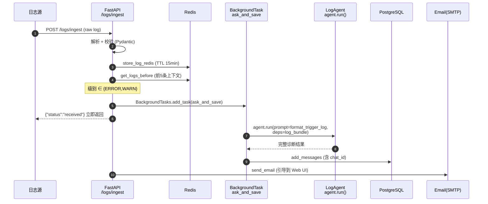
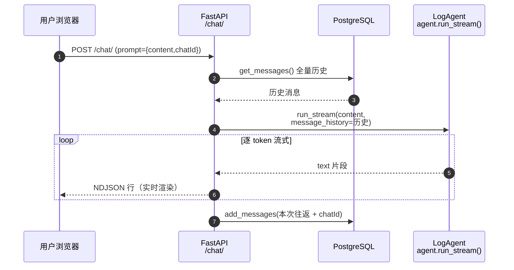
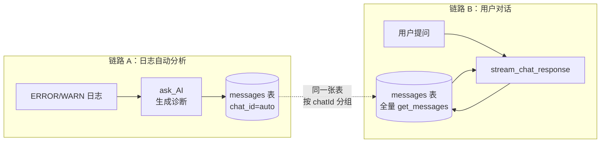

# 两条 LLM 链路对比：日志自动分析 vs 用户交互对话

> 相关代码：
> - 日志分析链路：`app/logs/service.py`（`ask_AI` / `ask_and_save` / `process_single_log`）
> - 用户对话链路：`app/chat/service.py`（`stream_chat_response`）
> - 共享 Agent：`app/llm/agent.py`（`LogAgent`）+ `app/main.py`（装配点）

---

## 0. 一句话区分

| 链路 | 是谁在问 | 问什么 | 怎么答 |
|---|---|---|---|
| **A. 日志自动分析**（`logs` 服务） | **机器**（ERROR/WARN 日志命中时自动触发） | 结构化日志 + 前 5 条上下文 | 一次性返回完整诊断报告，写库 + 发邮件 |
| **B. 用户交互对话**（`chat` 服务） | **人**（运维在 Web UI 输入） | 自由文本提问 | 流式逐字返回，UI 实时渲染 |

两者**共享同一个 `LogAgent` 实例**和同一个 DevOps system prompt，但调用方式、数据来源、执行模式完全不同。

---

## 1. 链路 A：日志自动分析

### 1.1 触发与入口

- **触发条件**：日志级别为 `ERROR` 或 `WARN`（`app/logs/service.py:63`）。
- **入口端点**：
  - `POST /logs/ingest` —— 外部系统推单条日志（`notify_email=True`）
  - `POST /logs/simulate` —— 模拟器回放样例日志（`notify_email=False`）

### 1.2 核心调用：`ask_AI()` —— 一次性、带 deps

```96:114:app/logs/service.py
async def ask_AI(log_bundle: dict, log_agent: LogAgent) -> str:
    """Run the LLM agent on a log bundle and return messages JSON."""
    trigger_log: dict = log_bundle['main_log']
    log_parsed = format_trigger_log(trigger_log)
    chat_id = generate_chat_id()

    try:
        AI_reply = await log_agent.agent.run(user_prompt=log_parsed, deps=log_bundle)

        messages_json = AI_reply.new_messages_json()
```

关键点：

- **`agent.run()`（非 stream）**：阻塞等待 LLM 返回完整结果。
- **`user_prompt=log_parsed`**：把触发日志用 `format_trigger_log()` 格式化成结构化文本（时间戳/级别/组件/消息）。
- **`deps=log_bundle`**：注入 `{main_log, earlier_logs}`，配合 `register_system_prompt` 装配的动态 prompt `"Analyze main_log... Use earlier_logs if useful."`，让模型分析这批日志。
- **无 `message_history`**：每次分析都是**全新独立对话**，不携带任何历史。
- **新 `chat_id`**：`generate_chat_id()` 生成 `chat-<毫秒>-<7hex>`，结果独立成会话。

### 1.3 执行时机：后台任务

```70:73:app/logs/service.py
            if background_tasks is not None:
                background_tasks.add_task(ask_and_save, log_bundle, db, log_agent)
            else:
                asyncio.create_task(ask_and_save(log_bundle, db, log_agent))
```

- 通过 FastAPI `BackgroundTasks` 或 `asyncio.create_task` 在**后台异步**执行。
- `/logs/ingest` 端点**立即返回** `{"status": "received"}`，不等待 LLM 出结果。

### 1.4 结果去向

`ask_and_save()`（`app/logs/service.py:121-125`）：

1. 调 `ask_AI` 拿到 LLM 回复。
2. `db.add_messages()` 写入 PostgreSQL `messages` 表（带 `chat_id`）。
3. 同时（在 `process_single_log` 里）若 `notify_email=True`，调 `send_email()` 发邮件告警，引导用户去 Web UI 查看。

### 1.5 时序图



---

## 2. 链路 B：用户交互对话

### 2.1 触发与入口

- **触发条件**：用户在 Web UI 输入框提交问题。
- **入口端点**：`POST /chat/`（`app/chat/routes.py:27`），表单字段 `prompt`。

### 2.2 核心调用：`stream_chat_response()` —— 流式、带历史

```71:90:app/chat/service.py
        messages = await db.get_messages()

        try:
            async with log_agent.agent.run_stream(
                content, message_history=messages, model=log_agent.agent.model
            ) as result:
                async for text in result.stream(debounce_by=0.01):
                    model_response = ModelResponse(
                        parts=[TextPart(text)],
                        timestamp=result.timestamp()
                    )
                    response_message = to_chat_message(model_response)
                    response_message['chatId'] = chat_id
                    yield json.dumps(response_message).encode('utf-8') + b"\n"
```

关键点：

- **`agent.run_stream()`（流式）**：逐 token 返回，前端 `ReadableStream` 实时渲染。
- **`content` 是用户自由文本**：如"刚才那个错误怎么修？"，**不是**结构化日志。
- **不传 `deps`**：走通用对话模式，不触发日志分析的动态 prompt。
- **`message_history=messages`**：`db.get_messages()` 拉取**全量历史**作为上下文，支持多轮对话。
- **`chat_id` 由前端传入**：保持会话连续性。

### 2.3 执行时机：同步流式

- HTTP 连接**保持打开**，`StreamingResponse` 逐行推 NDJSON。
- 流结束后才 `db.add_messages()` 持久化本次往返。

### 2.4 结果去向

1. 流式推给浏览器实时显示。
2. 流结束后 `db.add_messages()` 写入 PostgreSQL（`app/chat/service.py:90`）。
3. **不发邮件**（用户已在 UI 前）。

### 2.5 时序图



---

## 3. 七大差异对照表

| 维度 | A. 日志自动分析（`logs`） | B. 用户交互对话（`chat`） |
|---|---|---|
| **触发方** | 机器自动（ERROR/WARN 命中） | 人工（Web UI 输入） |
| **入口端点** | `POST /logs/ingest` / `/logs/simulate` | `POST /chat/` |
| **PydanticAI 调用** | `agent.run()` —— 一次性完整返回 | `agent.run_stream()` —— 流式逐 token |
| **prompt 内容** | `format_trigger_log()` 格式化的**结构化日志** | 用户**自由文本**问题 |
| **`deps` 注入** | `deps=log_bundle`（含 main_log + earlier_logs 前 5 条） | **不传 deps** |
| **`message_history`** | **无**，每次全新独立对话 | **加载 `db.get_messages()` 全量历史**，支持多轮 |
| **执行模式** | `BackgroundTasks` 后台异步，端点立即返回 | 同步流式，HTTP 连接保持推送 |
| **结果交付** | 写库 + **发邮件告警**引导用户看 UI | 直接在 **Web UI 实时显示** |
| **`chat_id` 来源** | `generate_chat_id()` 自动生成 | 前端传入（保持会话连续） |

---

## 4. 为什么用同一个 Agent 却表现不同？

两条链路共享 `app/main.py:37-38` 装配的**同一个 `LogAgent` 实例**：

```37:38:app/main.py
    log_agent = LogAgent()
    register_system_prompt(log_agent)
```

`LogAgent.__init__`（`app/llm/agent.py:56-60`）创建了带 DevOps system prompt 的 Agent：

```56:60:app/llm/agent.py
        self.agent = Agent(
            model=self.model_configs[chosen],
            deps_type=str,
            system_prompt=SYSTEM_PROMPT
        )
```

`SYSTEM_PROMPT` 内容（`app/llm/agent.py:16-20`）：

> "You are a DevOps expert. Your task is to analyze log messages received from Kafka and provide concise, actionable explanations or solutions..."

差异完全来自**调用姿势**，而非 Agent 本身：

| 调用姿势 | 触发的行为 |
|---|---|
| `run(user_prompt=..., deps=log_bundle)` | 激活 `register_system_prompt` 装的动态 prompt（`"Analyze main_log..."`）→ **分析 deps 里的日志** |
| `run_stream(content, message_history=...)` | 走通用流式对话 → **作为 DevOps 助手回答用户问题** |

> 这是 PydanticAI 的典型设计：**一个 Agent、多种调用方式**，靠 `deps` / `message_history` / 是否 stream 来切换业务模式。`deps_type=str` 决定了 deps 必须是字符串序列化形式（实际传的是 dict 的 repr）。

---

## 5. 关键设计耦合：两条链路如何"合流"

这是理解整个系统闭环的核心。



**两条链路共用同一张 `messages` 表**，由此形成闭环：

1. 链路 A 把日志诊断结果（带自动生成的 `chat_id`）写进 `messages` 表。
2. 链路 B 的 `GET /chat/` 调 `db.get_messages()` 拉取**所有会话**——**包括日志自动产生的**。
3. 用户在 Web UI 看到一个"日志告警会话"，可以**点开它继续追问**（链路 B 用链路 A 的 `chat_id` 接续对话）。

> 这正是 `ask_AI` 即便是自动触发也要分配 `chat_id`（`app/logs/service.py:100`）的原因——为了让它的结果能被聊天 UI 当作一个可继续的"会话"加载出来，实现 **"日志 → LLM 诊断 → 人机协作"** 的闭环。

---

## 6. 数据流总览

```
┌─────────────────────────── 链路 A：自动分析 ───────────────────────────┐
│                                                                        │
│  日志流入           后台任务                持久化           告警          │
│  ────────          ────────              ────────         ────────      │
│  /logs/ingest      ask_and_save          messages         send_email    │
│       │                │                    │                │          │
│       ▼                ▼                    │                ▼          │
│  parse+validate   agent.run(deps)          │          引导用户→Web UI   │
│  store Redis      ──────────►              │                             │
│  level check                              ▼                             │
│  ERROR/WARN ──────────────────────► 写入 messages 表                    │
│                                            ▲                             │
└────────────────────────────────────────────┼────────────────────────────┘
                                             │ 同一张表
┌─────────────────────────── 链路 B：人机对话 ─┼─────────────────────────┐
│                                            │                           │
│  用户提问           带历史流式              读+写           实时显示      │
│  ────────          ────────              ────────         ────────      │
│  /chat/            stream_chat_response   messages         NDJSON流      │
│       │                │                    │                │          │
│       ▼                ▼                    │                ▼          │
│  POST prompt      get_messages ────────────┘                           │
│                    run_stream(history)      │                           │
│                    逐 token ──────────────────────────► 浏览器渲染      │
│                                            ▲                           │
│                    流结束 add_messages ────┘                           │
│                                                                        │
└────────────────────────────────────────────────────────────────────────┘
```

---

## 7. 常见混淆点 FAQ

**Q1：`stream_chat_response` 里有"日志分析"吗？**
没有。它只处理用户在 Web UI 输入的文本。`chat` 服务里**完全不出现** `log_bundle`、`format_trigger_log`、`earlier_logs` 等日志概念。

**Q2：用户能在聊天里触发日志分析吗？**
不能直接触发。但用户可以**点开某个日志告警会话**（由链路 A 自动生成）继续追问——此时链路 B 把历史（含日志诊断结果）作为 `message_history` 传给 Agent，让它基于上下文回答。

**Q3：为什么日志分析不流式？**
日志分析在后台跑，没有"前端连接"可推。流式只在有人盯着浏览器的链路 B 才有意义。日志分析用 `agent.run()` 一次拿全结果即可。

**Q4：日志分析的 `deps` 是 dict 还是 str？**
`LogAgent` 声明 `deps_type=str`（`app/llm/agent.py:58`），但 `ask_AI` 传的是 `log_bundle`（dict）。PydanticAI 会把它转成 repr 当字符串用，`register_system_prompt` 里的 `ctx.deps` 拿到的是这个字符串化的内容。这是一个可优化的类型不严谨点。

**Q5：两条链路用的是同一个模型吗？**
是的，`LogAgent` 是单例，`change_model` 会同时影响两条链路。用户在 UI 用 `POST /set_model/` 切换模型，日志分析也会立刻用新模型。

---

## 8. 速查：函数 ↔ 链路映射

| 函数 | 所属链路 | 作用 |
|---|---|---|
| `app/logs/service.py:process_single_log` | A | 日志入库主流程（解析→Redis→级别判断→入队分析） |
| `app/logs/service.py:ask_AI` | A | 调 `agent.run()` 分析日志，返回消息 JSON |
| `app/logs/service.py:ask_and_save` | A | 包裹 `ask_AI` + 写库 |
| `app/logs/service.py:register_system_prompt` | A | 装配"分析 main_log"的动态 prompt |
| `app/chat/service.py:stream_chat_response` | B | 调 `agent.run_stream()` 流式对话 |
| `app/chat/service.py:to_chat_message` | B | PydanticAI 消息 → 浏览器格式的转换 |
| `app/llm/agent.py:LogAgent` | A+B | 共享的 Agent 封装 |
